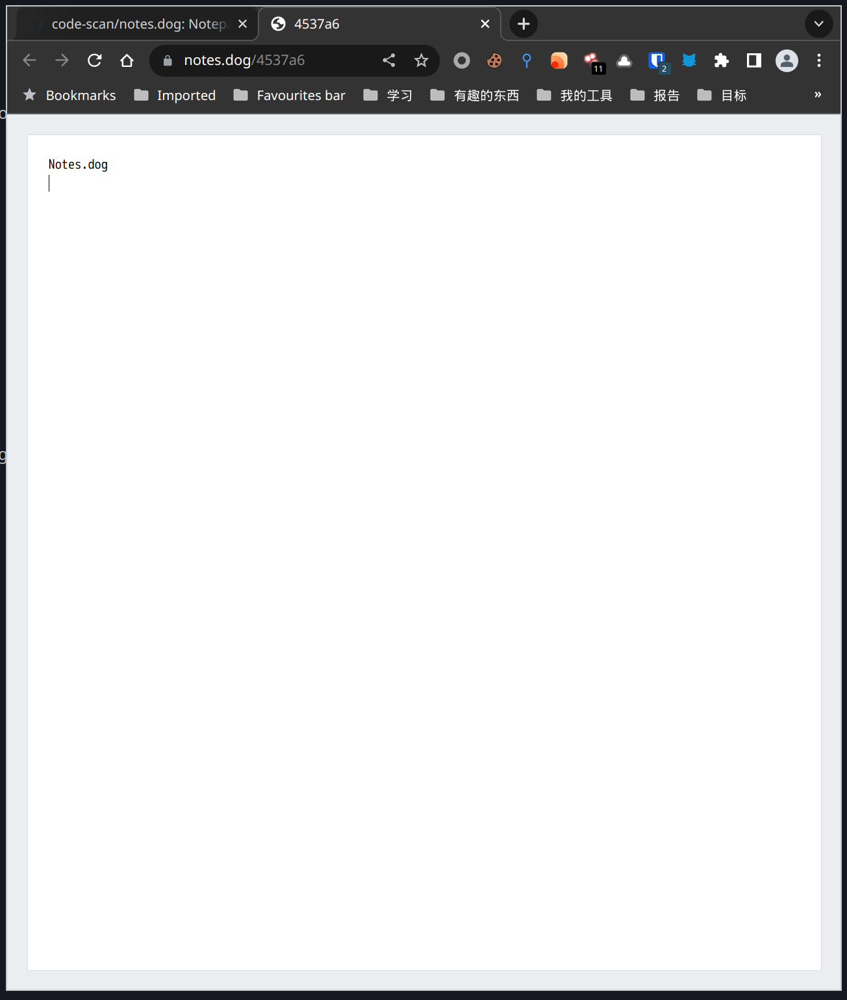

# Notes.dog

在线笔记本 文本分享


默认打开会随机生成一个路径

```bash
# 可以自定义路径,如:
https://notes.dog/demo.txt 
https://notes.dog/dog  
https://notes.dog/demo.php

# curl提交
curl -XPOST https://notes.dog/dog  --data 'text=dog'


# 搭建
./notes -l 0.0.0.0 -p 80
```


[体验地址](https://notes.dog)


